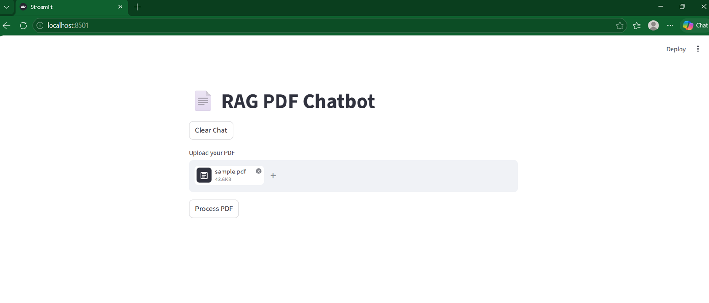
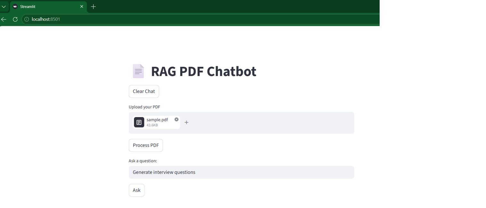
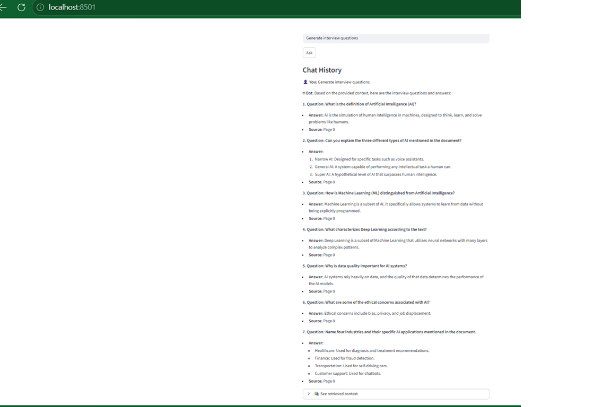

# Agentic RAG PDF Assistant

An Agentic Retrieval-Augmented Generation (RAG) assistant built using Python, FastAPI, Streamlit, LangChain, FAISS, and Gemini API.

This project allows users to upload PDF documents and interact with them using natural language queries. The assistant supports summarization, question answering, key point extraction, interview question generation, conversational memory, and source-aware contextual retrieval.

---

# Features

- PDF upload and processing
- Retrieval-Augmented Generation (RAG)
- Semantic search using FAISS vector database
- Gemini embeddings for document understanding
- Intent-aware routing
- Conversational memory for follow-up questions
- Interview question generation
- Key point extraction
- Source-aware contextual responses
- Hallucination control using prompt guardrails
- FastAPI backend APIs
- Streamlit frontend interface
- Modular backend architecture

---

# Tech Stack

| Component | Technology |
|---|---|
| Backend | FastAPI |
| Frontend | Streamlit |
| LLM | Gemini API |
| Framework | LangChain |
| Vector DB | FAISS |
| Embeddings | Google Generative AI Embeddings |
| Language | Python |
| Document Loader | PyPDFLoader |

---

# Architecture

```text
                ┌──────────────────┐
                │   User Query     │
                └────────┬─────────┘
                         │
                         ▼
                ┌──────────────────┐
                │ Streamlit UI     │
                └────────┬─────────┘
                         │
                         ▼
                ┌──────────────────┐
                │ FastAPI Backend  │
                └────────┬─────────┘
                         │
                         ▼
                ┌──────────────────┐
                │ Router Agent     │
                │ classify_intent  │
                └────────┬─────────┘
                         │
                         ▼
                ┌──────────────────┐
                │ FAISS Retriever  │
                └────────┬─────────┘
                         │
                         ▼
                ┌──────────────────┐
                │ Gemini LLM       │
                └────────┬─────────┘
                         │
                         ▼
                ┌──────────────────┐
                │ Grounded Answer  │
                │ + Citations      │
                └──────────────────┘
```

---

# Project Structure

```text
rag_pdf_chatbot/
│
├── backend/
│   ├── app.py
│   ├── agents/
│   │   └── router_agent.py
│   ├── prompts/
│   │   └── prompt_builder.py
│   ├── services/
│   └── utils/
│
├── frontend/
│   └── app_ui.py
│
├── rag/
│   └── rag_pdf.py
│
├── screenshots/
├── docs/
├── sample_data/
├── requirements.txt
├── README.md
└── .env
```

---

# Screenshots

## Upload & Process PDF



---

## User Question Input



---

## Agentic Interview Question Generation



---

# How It Works

1. User uploads PDF document
2. PDF text is extracted using PyPDFLoader
3. Text is split into chunks
4. Gemini embeddings are generated
5. Embeddings stored in FAISS vector database
6. Router agent detects user intent
7. Relevant chunks retrieved using semantic similarity
8. Prompt builder generates grounded prompt
9. Gemini LLM generates contextual response
10. Response returned with contextual grounding

---

# Supported User Tasks

- Summarize document
- Extract key points
- Generate interview questions
- Ask contextual questions
- Multi-turn follow-up conversations

---

# Example Questions

```text
Summarize this document
```

```text
Generate interview questions
```

```text
Give key points from this PDF
```

```text
Explain the second point more
```

---

# Setup Instructions

## 1. Clone Repository

```bash
git clone <your_repo_url>
```

## 2. Create Virtual Environment

```bash
python -m venv .venv
```

## 3. Activate Virtual Environment

### Windows

```bash
.venv\\Scripts\\activate
```

## 4. Install Dependencies

```bash
pip install -r requirements.txt
```

## 5. Create `.env` file

```text
GEMINI_API_KEY=your_api_key_here
```

## 6. Run FastAPI Backend

```bash
python -m uvicorn backend.app:app --reload
```

Backend runs at:

```text
http://127.0.0.1:8000
```

## 7. Run Streamlit Frontend

Open another terminal:

```bash
python -m streamlit run frontend/app_ui.py
```

Frontend runs at:

```text
http://localhost:8501
```

---

# Future Improvements

- LangGraph-based multi-agent orchestration
- Redis-backed memory
- Hybrid search retrieval
- Evaluation pipelines
- Docker containerization
- GCP Cloud Run deployment
- Authentication and user sessions
- Multi-document comparison agent

---

# Resume Highlight

Built an Agentic Retrieval-Augmented Generation (RAG) assistant using Python, FastAPI, Streamlit, LangChain, FAISS, and Gemini API for intelligent document interaction.

Implemented intent-aware routing, conversational memory, semantic retrieval, contextual grounding, prompt engineering, and modular AI backend architecture.

---

# Author
Radhasree Sanagapati